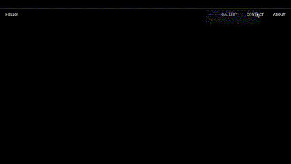

# JS Animation Project using GSAP Library

This project showcases my first attempt at creating JavaScript animations using the GSAP (GreenSock Animation Platform) library. GSAP is a powerful animation library that allows for smooth and efficient animations on the web.

## Live Demo
You can view the live demo of this project [here](https://kunalbandale.github.io/Animated-Website/)

## Getting Started
To run this project locally, follow these steps:
1. Clone this repository to your local machine.
2. Open the `index.html` file in your web browser.
3. Explore the animations and interactions implemented using GSAP.

## Technologies Used
- HTML
- CSS
- JavaScript
- GSAP (GreenSock Animation Platform)

## Features
- Smooth animations
- Interactive elements
- Easy-to-understand code structure

## Usage
Feel free to explore the codebase, modify it, and use it in your own projects. This project serves as a learning resource for implementing animations with GSAP.

## Contribution
Contributions are welcome! If you have any suggestions or improvements, feel free to open an issue or submit a pull request.

## License
This project is licensed under the [MIT License](LICENSE). Feel free to use it for personal or commercial projects.

---

Enjoy animating with GSAP! If you have any questions or feedback, feel free to reach out. Happy coding!
